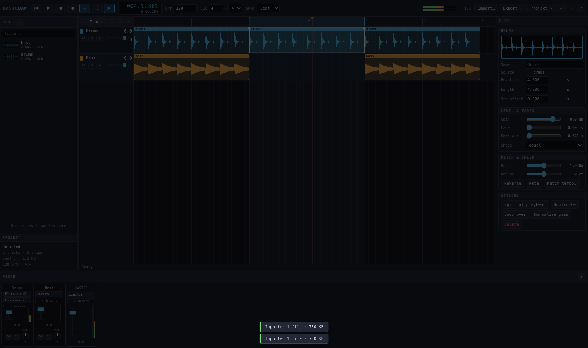

# Basic DAW

A multitrack audio workstation that runs entirely in a browser tab. No build
step, no server, no dependencies — open `index.html` and it works, and it hosts
on GitHub Pages as-is.

Built for personal dev work on real material: import stems, arrange and edit
them, mix with insert effects, bounce a master or a set of stems back out.



## Run it

```sh
# any static server; ES modules won't load over file://
python3 -m http.server 8000
open http://localhost:8000
```

## Host it on GitHub Pages

```sh
git init && git add . && git commit -m "basic daw"
git branch -M main
git remote add origin git@github.com:<you>/<repo>.git
git push -u origin main
```

Then **Settings → Pages → Source: Deploy from a branch → main / (root)**.
There is nothing to build; the repo *is* the site.

Everything runs client-side, so nothing you import ever leaves your machine.

## What it does

**Arrangement**
- Import WAV / MP3 / OGG / FLAC / M4A / AIFF by drag-and-drop, anywhere in the window
- Unlimited tracks and clips, canvas-rendered waveforms with a peak pyramid
  (scrolling stays smooth at any zoom)
- Drag to move (multi-select, cross-track), drag edges to trim, drag the top
  corners for fades, `S` to split at the playhead, Alt-drag to copy
- Grid snapping down to 1/16 and triplets, or off; hold Shift to ignore the grid
- Loop region, markers, marquee select, clipboard, unlimited undo

**Clips**
- Gain, fade in/out with equal-power / linear / exponential shapes
- Playback rate and detune (±2400 cents), reverse, mute
- "Match tempo" stretches a clip to a whole number of bars
- Normalize gain from the analysed source peak

**Mixer**
- Per-track fader, pan, mute/solo/arm, live peak meter; stereo master meter
- Insert chains on every track and the master, twenty effects out of the box:
  4-band EQ (with a live response curve), tilt EQ, filter, auto-wah, compressor,
  limiter, noise gate, delay, ping-pong echo, reverb, plate reverb, chorus,
  tremolo, saturator, tube warmth, bit crusher, wavefolder, stereo width, Haas
  widener, trim
- Bypass, reorder, remove per insert; parameters are smoothed, not stepped
- New effects are plugins — write one as a JSON manifest, no code (see below)

**Transport & recording**
- Sample-accurate look-ahead scheduling, bar-accurate looping, metronome
- Record from any input device onto armed tracks (raw float capture, not Opus)

**Export**
- Bounce the master, the loop region, or the selection to 16/24-bit or 32-bit
  float WAV at 44.1 / 48 / 96 kHz, with an optional tail and peak normalize
- Export stems: one WAV per track, post-insert, pre-master

**Plugins**
- Effects are plugins, added through a registry rather than baked in
- A plugin can be a **JSON manifest** describing a graph of Web Audio nodes —
  no code, so one from a URL is safe to install — or a **JS module** for the
  handful of effects that need per-frame logic
- Install from a file, a URL, or pasted text; user plugins persist in IndexedDB
- An insert whose plugin is missing passes audio through and keeps its settings,
  so opening a session without a plugin never silently loses the effect
- Project ▾ → Plugins… to manage them

**Sessions**
- Autosaved to IndexedDB every 20 seconds and restored on reload — audio
  included, kept as the original imported files rather than decoded PCM
- `.dawproj` export (document only) or bundle export (audio inlined) to move a
  session to another machine

Press `?` in the app for the full keyboard map.

## Layout

```
index.html            markup shell — panels, toolbar, hidden file inputs
css/style.css         the whole theme
src/
  main.js             bootstrap, frame loop, splitters
  state.js            project document, selection, undo, grid maths
  assets.js           import → decode → peak pyramid → IndexedDB
  project.js          save/open/export, bounce dialogs
  audio/
    engine.js         AudioContext graph, transport, look-ahead scheduler
    effects.js        insert chain wiring (buildChain / disposeChain)
    render.js         OfflineAudioContext bounce, normalize, analysis
    peaks.js          min/max peak pyramid + waveform drawing
    wav.js            WAV encode, and a decoder for what browsers reject
  plugins/
    registry.js       register / look up / categories / legacy id aliases
    schema.js         the node vocabulary, and the validator built from it
    graph.js          JSON manifest -> live audio graph
    expr.js           expression compiler for manifests (no eval, ever)
    dsp.js            curves and impulse responses, shared by both tiers
    builtin.js        the eleven effects written in JS
    loader.js         install from file / URL / text, persist to IndexedDB
    bundled/          the nine effects written as JSON manifests
  storage/db.js       IndexedDB wrapper
  ui/
    timeline.js       arrangement canvas: ruler, clips, every edit gesture
    tracks.js         track headers
    mixer.js          strips, inserts, meters
    inspector.js      clip / track / master / effect editors
    pool.js           sample browser
    transport.js      toolbar and readouts
    controls.js       knob, fader, slider row, meter widgets
    keys.js           keyboard map (and the help dialog that documents it)
    plugins.js        the plugin manager dialog
```

Three design rules hold the thing together:

1. **The bounce shares the playback code.** `buildChain` and the clip envelope
   maths in `engine.js` are called by both the live graph and the offline
   render, so an export can't drift from what you heard.
2. **Layout is derived, never stored.** The arrangement is
   `x = (t - scrollX) * pxPerSec` over the document; there is no view model to
   keep in sync.
3. **A parameter schema is the only UI a plugin declares.** `params` drives the
   whole editor — widget, range, formatting, undo. There is no per-effect
   markup anywhere in the app.

## Writing a plugin

A tremolo, complete — three parameters, five nodes, no code:

```json
{
  "id": "me.tremolo",
  "name": "Tremolo",
  "category": "Modulation",
  "params": [
    { "key": "rate",  "label": "Rate",  "min": 0.1, "max": 20, "def": 4.5, "unit": "Hz", "log": true },
    { "key": "depth", "label": "Depth", "min": 0,   "max": 1,  "def": 0.6 }
  ],
  "graph": {
    "nodes": { "vca": { "type": "gain" }, "lfo": { "type": "osc" }, "amt": { "type": "gain" } },
    "connect": [["in", "vca", "out"], ["lfo", "amt", "vca.gain"]],
    "bind": [
      { "param": "rate",  "to": "lfo.frequency" },
      { "param": "depth", "to": "amt.gain", "map": "x / 2" },
      { "param": "depth", "to": "vca.gain", "map": "1 - x / 2" }
    ]
  }
}
```

Paste that into Project ▾ → Plugins… and it shows up in the "+ insert" menu with
a full editor.

- **[docs/plugins.md](docs/plugins.md)** — the manifest format: node vocabulary,
  expressions, curve and impulse-response recipes, conditional rewiring, and the
  JS tier for effects JSON cannot express.
- **[docs/ui-components.md](docs/ui-components.md)** — how each `params` field
  becomes a control, and how to pick ranges that feel right.

Check a manifest without installing it:

```sh
node .claude/skills/daw-plugin/validate.mjs my-plugin.json --build
```

`--build` instantiates the graph against a mock AudioContext and sweeps every
parameter, which catches what static validation cannot — and verifies that the
live and offline builds agree, so a bounce still matches playback.

There is a `/daw-plugin` skill that walks an agent through designing one to spec.

## Known limits

- Rate changes are resampling, not time-stretching: speed and pitch move
  together. There is no phase vocoder.
- Overlapping clips on one track both play; no automatic crossfade.
- No parameter automation lanes yet — mixer moves are static per session.
- Storage is per-origin browser storage. Export a bundle before clearing site
  data, and don't expect a session to follow you between browsers.

## Poking at it

The app exposes itself on `window.daw` (`state`, `engine`, `assets`, `timeline`,
`tracks`, `mixer`-side modules, `project`, `effects`, `plugins`, `render`,
`undo`, `redo`)
so you can drive it from the console:

```js
daw.state.project.clips.length
daw.engine.play(4)
daw.timeline.zoomToFit()
daw.state.project.tracks[0].fx.push(daw.plugins.newEffect("json.pingpong"))
daw.engine.syncGraph()
await daw.render.renderRange(0, 30)   // bounce a range to an AudioBuffer

daw.plugins.allPlugins().map((p) => p.id)
await daw.plugins.installManifest(jsonText, { replace: true })
```

`test-audio/` holds two generated stems for trying things out.
